# PROJECT 15 AWS CLOUD SOLUTION FOR 2 COMPANY WEBSITES USING A REVERSE PROXY TECHNOLOGY

## Created VPC
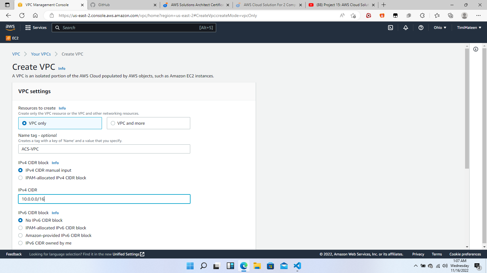

## Created Internet Gateway
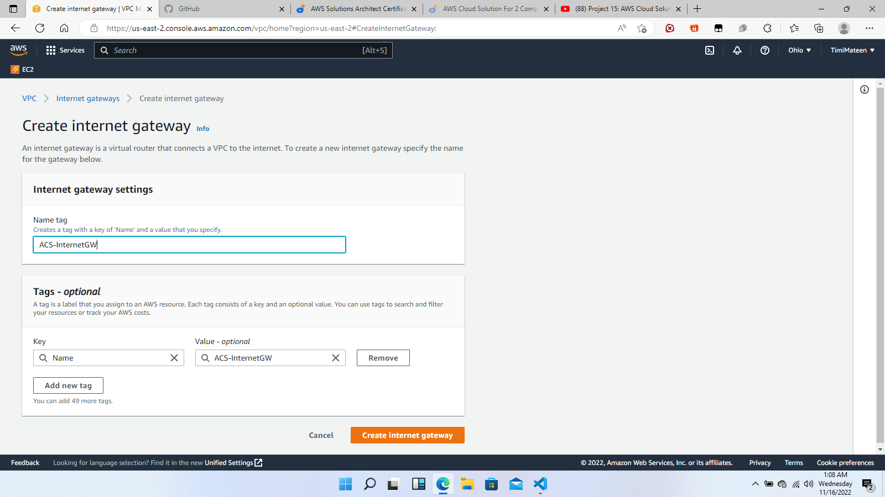

## Attached internet gateway to VPC


## Created Subnet

- Private Subnet-1


- Private Subnet-2


- Private Subnet-3
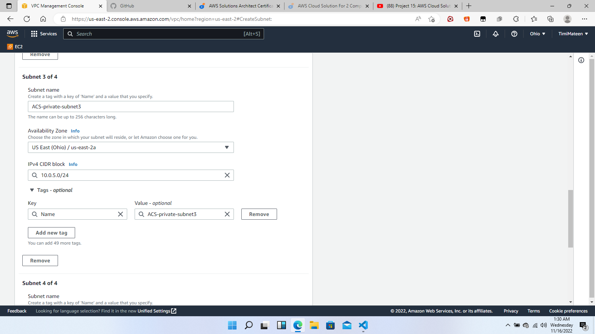

- Private Subnet-4


- Public Subnet-1
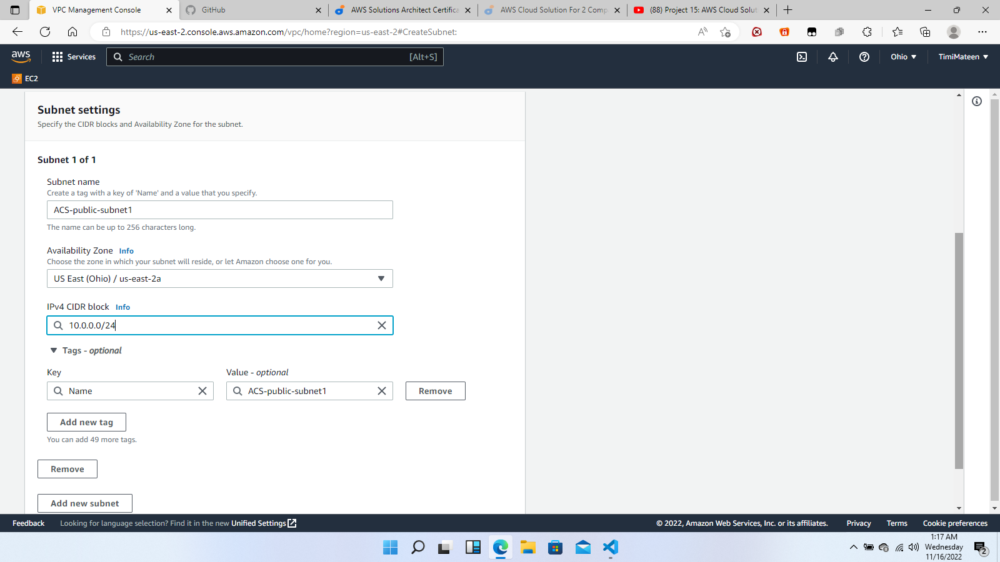

- Public Subnet-2
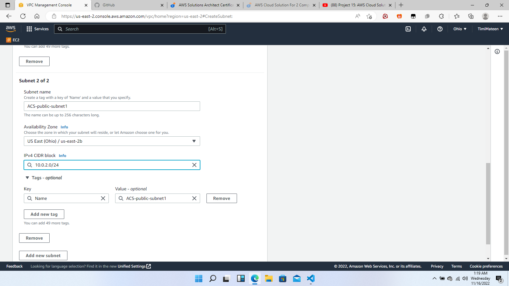

##  Creating Route Table
- Private Route table
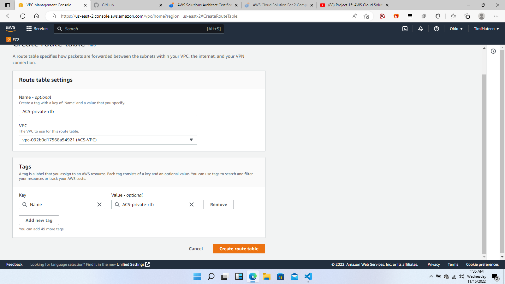

- Public Route table
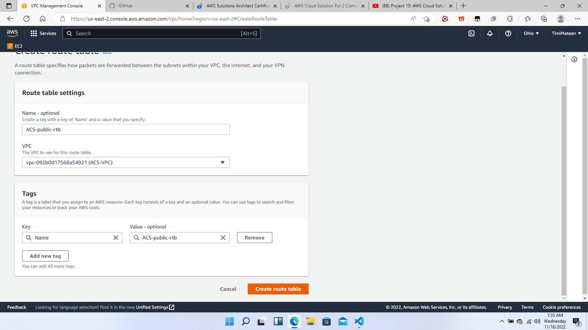

## Subnet Association with RTB
- Private Association


-Public Association


## Creating NAT Gateway
- NAT Gateway
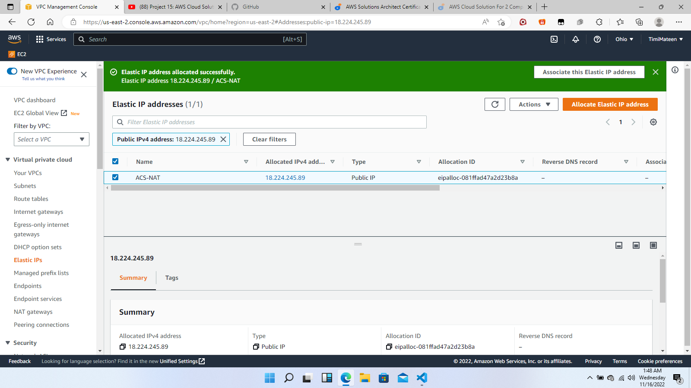

## Assocaiating NAT gateway to Private IP
- NAT gateway to Private IP


## Security Groups

- NGINX SERVER

- BASTION SERVER

- APPLICATION AND LOAD BALANCER
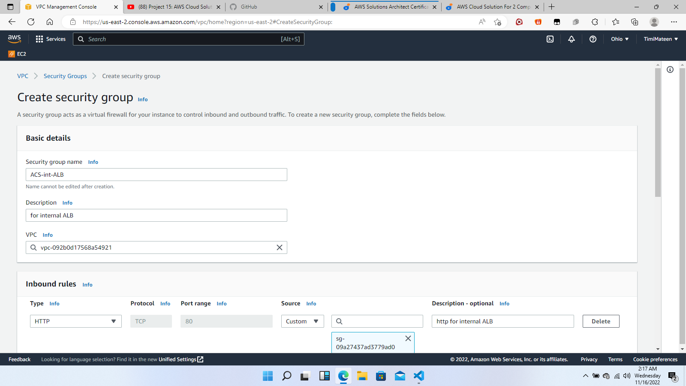

- WEB SERVER
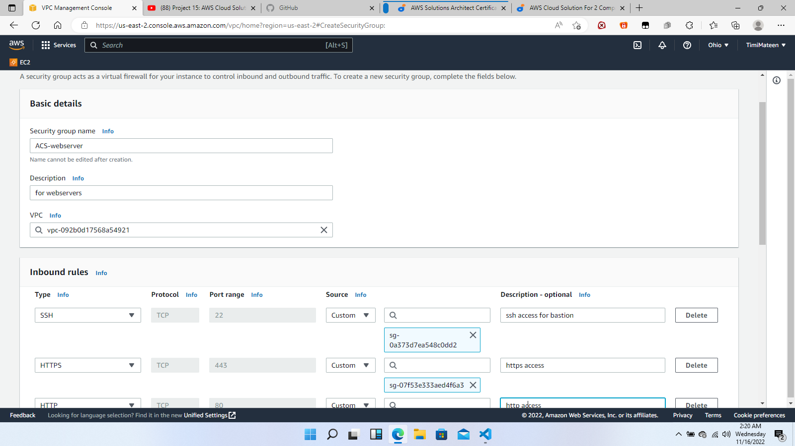
- DATA LAYER
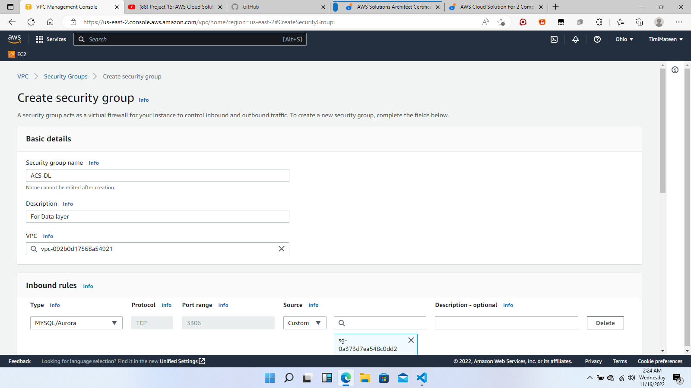

## AWS certificate
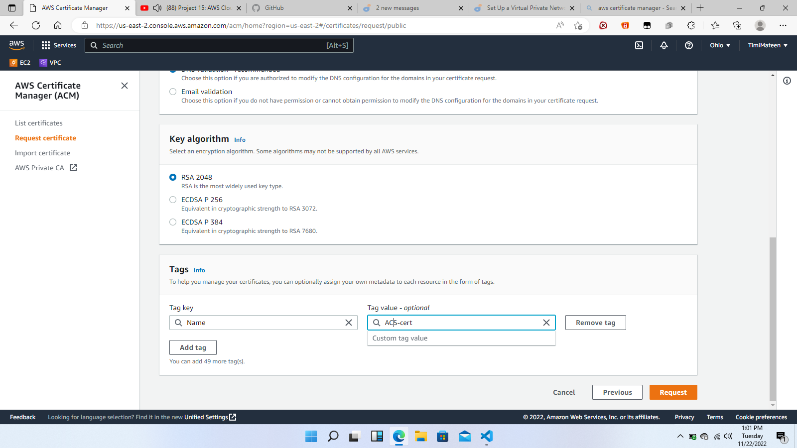

## File system
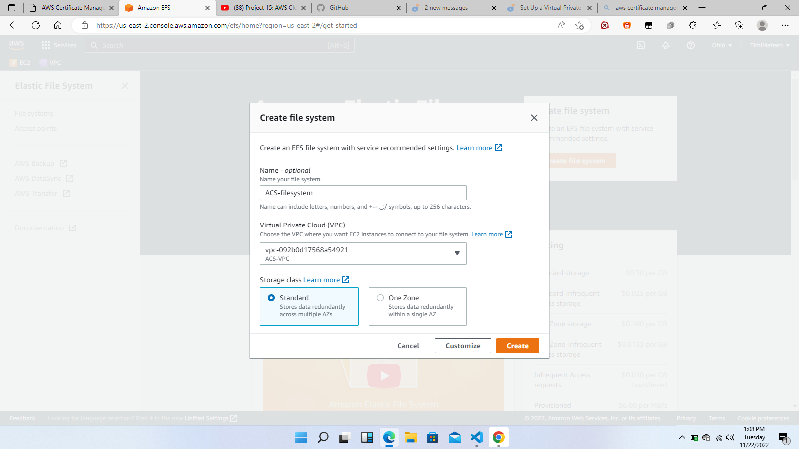

## Created Access points
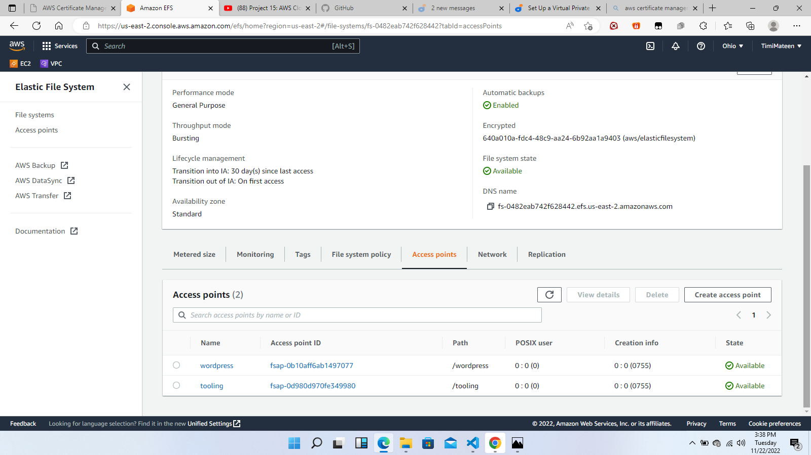

## ACS-RDS setup
- Acs rds


-Acs-rds-subnet


-RDS database


## Bastion ami installation
-------------------------------------
yum install -y https://dl.fedoraproject.org/pub/epel/epel-release-latest-8.noarch .rpm
yum install -y dnf-utils http://rpms.remirepo.net/enterprise/remi-release-8.rpm
yum install wget vim python3 telnet htop git mysql net-tools chrony -y
systemctl start chronyd
systemctl enable chronyd

## Nginx ami installation 
-----------------------------------------
```
yum install -y https://dl.fedoraproject.org/pub/epel/epel-release-latest-8.noarch.rpm

yum install -y dnf-utils http://rpms.remirepo.net/enterprise/remi-release-8.rpm

yum install wget vim python3 telnet htop git mysql net-tools chrony -y

systemctl start chronyd

systemctl enable chronyd
```

## webserver ami installation 
```
yum install -y https://dl.fedoraproject.org/pub/epel/epel-release-latest-8.noarch.rpm

yum install -y dnf-utils http://rpms.remirepo.net/enterprise/remi-release-8.rpm

yum install wget vim python3 telnet htop git mysql net-tools chrony -y

systemctl start chronyd

systemctl enable chronyd
```

### setup for self-signed certificate for the nginx instance
```
sudo mkdir /etc/ssl/private

sudo chmod 700 /etc/ssl/private

openssl req -x509 -nodes -days 365 -newkey rsa:2048 -keyout /etc/ssl/private/ACS.key -out /etc/ssl/certs/ACS.crt

sudo openssl dhparam -out /etc/ssl/certs/dhparam.pem 2048
```
## setup of for self-signed certificate for the apache  webserver instance
```
yum install -y mod_ssl

openssl req -newkey rsa:2048 -nodes -keyout /etc/pki/tls/private/ACS.key -x509 -days 365 -out /etc/pki/tls/certs/ACS.crt

vi /etc/httpd/conf.d/ssl.conf
```
## ACS AMI image
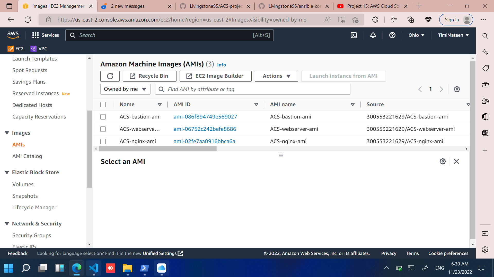

## ACS target groups
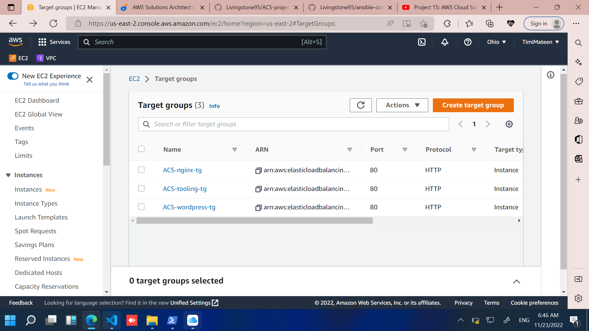

## ACS load balancer

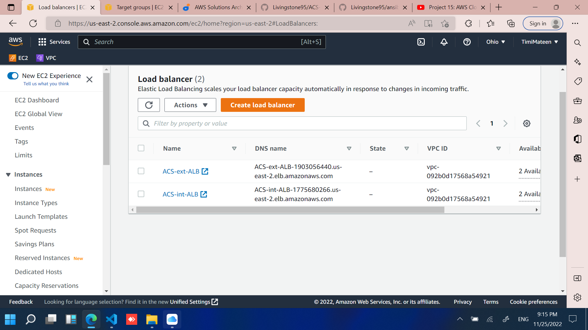

## Launch template setup
### Bastion user-data
```
#!/bin/bash
yum install -y mysql
yum install -y git tmux
yum install -y ansible

```
### Nginx user-data
```
#!/bin/bash
yum install -y nginx
systemctl start nginx
systemctl enable nginx
git clone https://github.com/Livingstone95/ACS-project-config.git
mv /ACS-project-config/reverse.conf /etc/nginx/
mv /etc/nginx/nginx.conf /etc/nginx/nginx.conf-distro
cd /etc/nginx/
touch nginx.conf
sed -n 'w nginx.conf' reverse.conf
systemctl restart nginx
rm -rf reverse.conf
rm -rf /ACS-project-config


```

### Wordpress user-data
```
#!/bin/bash
mkdir /var/www/
sudo mount -t efs -o tls,accesspoint=fsap-0f9364679383ffbc0 fs-8b501d3f:/ /var/www/
yum install -y httpd 
systemctl start httpd
systemctl enable httpd
yum module reset php -y
yum module enable php:remi-7.4 -y
yum install -y php php-common php-mbstring php-opcache php-intl php-xml php-gd php-curl php-mysqlnd php-fpm php-json
systemctl start php-fpm
systemctl enable php-fpm
wget http://wordpress.org/latest.tar.gz
tar xzvf latest.tar.gz
rm -rf latest.tar.gz
cp wordpress/wp-config-sample.php wordpress/wp-config.php
mkdir /var/www/html/
cp -R /wordpress/* /var/www/html/
cd /var/www/html/
touch healthstatus
sed -i "s/localhost/acs-database.cdqpbjkethv0.us-east-1.rds.amazonaws.com/g" wp-config.php 
sed -i "s/username_here/ACSadmin/g" wp-config.php 
sed -i "s/password_here/admin12345/g" wp-config.php 
sed -i "s/database_name_here/wordpressdb/g" wp-config.php 
chcon -t httpd_sys_rw_content_t /var/www/html/ -R
systemctl restart httpd

```
### Tooling user-data
```
#!/bin/bash
mkdir /var/www/
sudo mount -t efs -o tls,accesspoint=fsap-01c13a4019ca59dbe fs-8b501d3f:/ /var/www/
yum install -y httpd 
systemctl start httpd
systemctl enable httpd
yum module reset php -y
yum module enable php:remi-7.4 -y
yum install -y php php-common php-mbstring php-opcache php-intl php-xml php-gd php-curl php-mysqlnd php-fpm php-json
systemctl start php-fpm
systemctl enable php-fpm
git clone https://github.com/Livingstone95/tooling-1.git
mkdir /var/www/html
cp -R /tooling-1/html/*  /var/www/html/
cd /tooling-1
mysql -h acs-database.cdqpbjkethv0.us-east-1.rds.amazonaws.com -u ACSadmin -p toolingdb < tooling-db.sql
cd /var/www/html/
touch healthstatus
sed -i "s/$db = mysqli_connect('mysql.tooling.svc.cluster.local', 'admin', 'admin', 'tooling');/$db = mysqli_connect('acs-database.cdqpbjkethv0.us-east-1.rds.amazonaws.com', 'ACSadmin', 'admin1234', 'toolingdb');/g" functions.php
chcon -t httpd_sys_rw_content_t /var/www/html/ -R
systemctl restart httpd

```